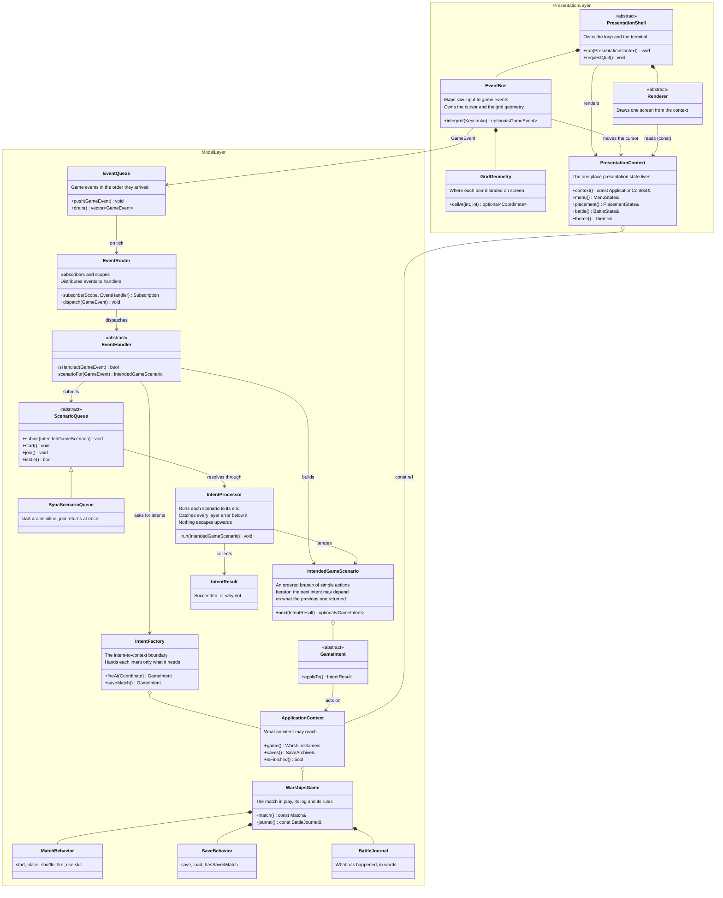
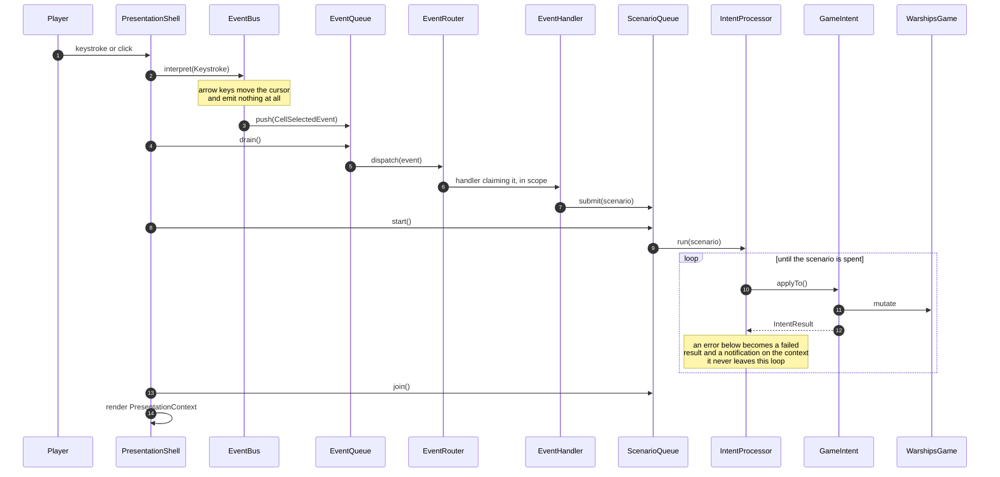
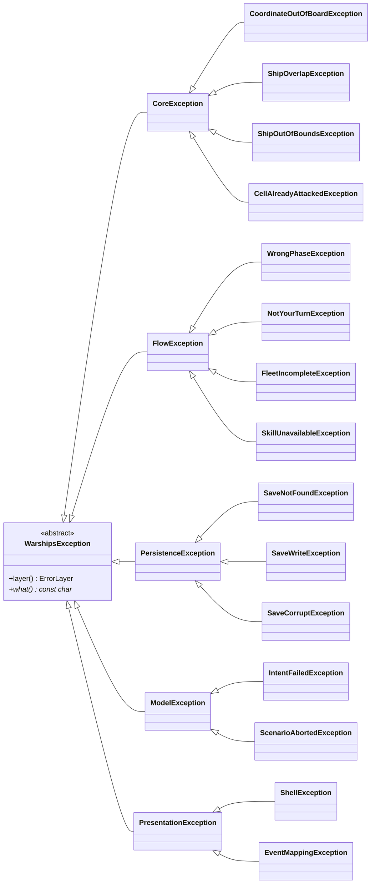

# cpp-warships — target architecture

Two layers, each its own CMake target. The model never draws and never reads input;
the head never decides anything. What crosses between them is `ApplicationContext`,
handed to the head as `const`.

| Directory | Target | Layer |
|---|---|---|
| `cpp_warships/application/core` | `warships_core` | rules, error root |
| `cpp_warships/application/flow` | `warships_flow` | match orchestration |
| `cpp_warships/application/persistence` | `warships_persistence` | saves |
| `cpp_warships/application/model` | `warships_model` | events, intents, scenarios, game state |
| `cpp_warships/application/head/{common,plain}` | `warships_head` | presentation, no drawing library |
| `cpp_warships/application/head/ftxui` | `warships_head_ftxui` | FTXUI renderers |

`warships_head` must link without FTXUI. `plain/` lives in that target so the build
itself proves it: leak an FTXUI include into `common/` and `warships_head` stops
compiling.

## Structure

`PresentationContext` holding a `const ApplicationContext&` is the whole seam. The head
can read everything and write nothing; the compiler enforces it rather than discipline.

## One tick

Navigation is not an intent. The head picks its renderer from `MatchPhase`, so a phase
change *is* the navigation. Quitting is a scenario that ends by setting
`ApplicationContext::isFinished`, which the shell loop observes — that keeps quit
sequenced behind a save without making it a navigation step.

## Errors

Rooted in `application/core`, one subtree per layer, each caught at that layer's
entry point so nothing below leaks above it.

| Entry point | Catches | Emits |
|---|---|---|
| `Match` methods | `CoreException` | wraps as `FlowException` |
| `SaveArchive` | `serialization::*` | wraps as `PersistenceException` |
| **`IntentProcessor`** | core, flow, persistence | **an `IntentResult` — never rethrows** |
| shell loop | `PresentationException` | its own message |

Leaves carry typed fields, not just text — `CoordinateOutOfBoardException` holds the
offending `Coordinate` and the board size. Wrapping keeps the cause as a string rather
than `std::nested_exception`. The existing `serialization::exceptions::*` stay where
they are and keep their own shape: that library is generic and should not know the
word "warships".

Because `IntentProcessor` never lets an exception past it, the head learns of failure
by reading a notification off the context, not by catching anything.

## What lives where, and why

| Thing | Layer | Reason |
|---|---|---|
| cursor, aim, selected ship length, board size, theme, log scroll | head | input affordances, not game concepts — mouse play has no cursor at all |
| grid geometry and hit-testing | head | whoever drew the grid is the only one who knows where it landed |
| which screen shows | head | derived from `MatchPhase`; nothing to decide |
| ordering of actions within one event | model | `IntendedGameScenario`, locally and visibly, not a global priority table |
| what an intent may touch | model | `IntentFactory` injects at construction; intents never see the whole context |

## Open

- Menu versus in-match is not a `MatchPhase` today. Either add a value, or give
  `ApplicationContext` its own session state.
- `WarshipsGame` owns `BattleJournal`, so saves should start carrying it. Loaded games
  currently resume with an empty log. The JSON reader already tolerates absent fields,
  so this can land without breaking existing saves.
- `placeFleetRandomly` uses the default segment health while `placeShip` passes the
  configured value, so computer and shuffled fleets ignore the setting.
