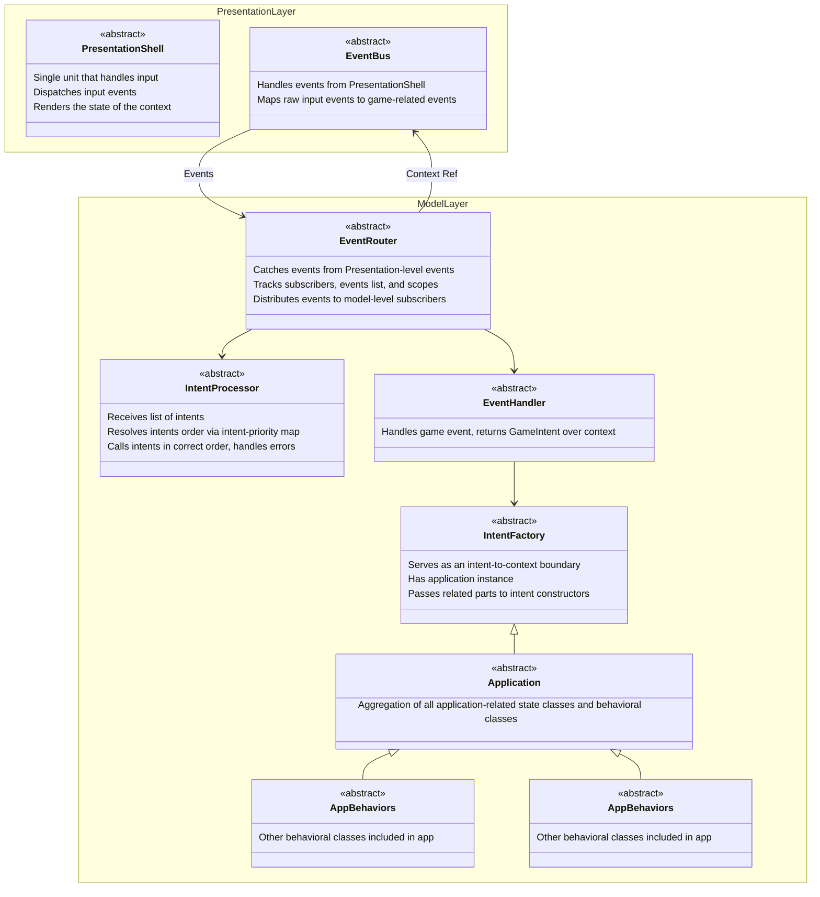

```mermaid
classDiagram
    direction TB

    namespace PresentationLayer {
        class PresentationShell {
            <<abstract>>
            Single unit that handles input
            Dispatches input events
            Renders the state of the context
        }
        class EventBus {
            <<abstract>>
            Handles events from PresentationShell
            Maps raw input events to game-related events
        }
    }

    namespace ModelLayer {
        class EventRouter {
            <<abstract>>
            Catches events from Presentation-level events
            Tracks subscribers, events list, and scopes
            Distributes events to model-level subscribers
        }
        class IntentProcessor {
            <<abstract>>
            Receives list of intents
            Resolves intents order via intent-priority map
            Calls intents in correct order, handles errors
        }
        class EventHandler {
            <<abstract>>
            Handles game event, returns GameIntent over context
        }
        class IntentFactory {
            <<abstract>>
            Serves as an intent-to-context boundary
            Has application instance
            Passes related parts to intent constructors
        }
        class Application {
            <<abstract>>
            Aggregation of all application-related state classes and behavioral classes
        }
        class AppBehaviorsA["AppBehaviors"] {
            <<abstract>>
            Other behavioral classes included in app
        }
        class AppBehaviorsB["AppBehaviors"] {
            <<abstract>>
            Other behavioral classes included in app
        }
    }

    EventBus --> EventRouter : Events
    EventRouter --> EventBus : Context Ref
    EventRouter --> IntentProcessor
    EventRouter --> EventHandler
    EventHandler --> IntentFactory
    Application <|-- AppBehaviorsA
    Application <|-- AppBehaviorsB
    IntentFactory <|-- Application
```